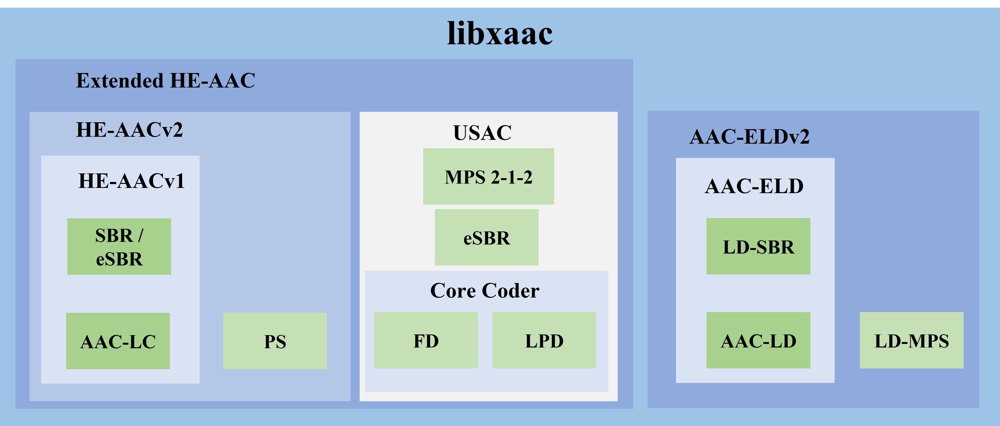

# Introduction to libxaac

Extended HE-AAC, the latest innovation member of the MPEG AAC codec family, is ideally suited for adaptive bit rate streaming and digital radio applications. Extended HE-AAC bridges the gap between speech and audio coding and ensures consistent high-quality audio for all signal types, including speech, music, and mixed material. It is the required audio codec for DRM (Digital Radio Mondiale). When it comes to coding, the codec is incredibly effective, generating high-quality audio for music and speech at bitrates as low as 6 kbit/s for mono and 12 kbit/s for stereo services. By switching to extremely low bitrate streams, Extended HE-AAC streaming apps and streaming radio players can provide uninterrupted playback even during very congested network conditions.

As the Extended High Efficiency AAC Profile is a logical evolution of the MPEG Audio's popular AAC Family profiles, the codec supports AAC-LC, HE-AACv1 (AAC+) and HE-AACv2 (eAAC+) audio object type encoding. The bitrate that was saved with AAC family tools can be used to enhance video quality. Extended HE-AAC is a well-liked option for a number of applications since it is a strong and effective audio codec that provides high-quality audio at low bitrates.



One of the key features of libxaac (refer to above image) is that it has support for AAC-LD (Low Delay), AAC-ELD (Enhanced Low Delay), and AAC-ELDv2 (Enhanced Low Delay version 2) modes. AAC-LD mode provides low latency encoding, making it suitable for applications such as interactive communication and live audio streaming. It helps to reduce the delay in the encoding process to improve the real-time performance of the system. AAC-ELD mode improves the low-delay performance of HE-AAC by reducing the coding delay while maintaining high audio quality. It was observed that minimum delay it can achieve is 15ms. In order to achieve low delay coding scheme and low bitrate, it uses the Low Delay SBR tool. AAC-ELDv2 is the most advanced version of AAC-based low delay coding. It provides an enhanced version of AAC-ELD, which provides even lower coding delay and higher audio quality.

MPEG-D USAC, also known as Unified Speech and Audio Coding, is designed to provide high-quality audio coding at low bit rates. MPEG-D USAC combines advanced audio coding techniques with state-of-the-art speech coding algorithms to achieve significant compression gains while maintaining perceptual audio quality. The standard supports a wide range of audio content, including music, speech, and mixed audio, making it versatile for different use cases. With its ability to deliver high-fidelity audio at reduced bit rates, MPEG-D USAC plays a crucial role in optimizing bandwidth usage and enhancing the user experience in the digital audio domain.

Overall, libxaac, with support for AAC-LD, AAC-ELD, and AAC-ELDv2 modes, is a versatile audio coding technology that can be used for a wide range of applications, such as broadcasting, streaming, and teleconferencing which requires high-quality audio compression with minimal delay. 

Also, the libxaac supports MPEG-D DRC (Dynamic Range Control) for the Extended HE-AAC profile in both encoder and decoder. MPEG-D DRC offers a bitrate efficient representation of dynamically compressed versions of an audio signal. This is achieved by adding a low-bitrate DRC metadata stream to the audio signal. DRC includes dedicated sections for metadata-based loudness leveling, clipping prevention, ducking, and for generating a fade-in and fade-out to supplement the main dynamic range compression functionality. The DRC effects available at the DRC decoder are generated at the DRC encoder side. At the DRC decoder side, the audio signal may be played back without applying DRC, or an appropriate DRC effect is selected and applied based on the given playback scenario. It offers flexible solutions to efficiently support the widespread demand for technologies such as loudness normalization and dynamic range compression for various playback scenarios.  

#### Note
* The operating points for MPEG-D USAC (along with MPEG-D DRC) in libxaac encoder is currently restricted to 64 kbps and 96 kbps. It is recommended to use the encoder at these operating points only. The support shall be extended to other operating points soon.
* Further Quality enhancements for AAC-ELD and AAC-ELDv2 modes may be pushed as quality assessment is in progress.

#  Building the libxaac decoder and encoder

## Building for AOSP
* Makefile for building the libxaac decoder and encoder library is provided in root(`libxaac/`) folder.
* Makefile for building the libxaac decoder and encoder testbench is provided in `test` folder.
* Build the library followed by the application using the below commands:
Go to root directory
```
$ mm
```

## Using CMake
Users can also use cmake to build for `x86`, `x86_64`, `armv7`, `armv8` and Windows (MSVS project) platforms.

### Creating MSVS project files
To create MSVS project files for the libxaac decoder and encoder from cmake, run the following commands:
```
Go to the root directory(libxaac/).
Create a new folder in the project root directory and move to the newly created folder.

$ cd <path to libxaac>
$ mkdir bin
$ cd bin
$ cmake -G "Visual Studio 15 2017" ..
```

Above command will create Win32 version of MSVS workspace 
To create MSVS project files for Win64 version from cmake, run the following commands:
```
$ mkdir cmake_build
$ cd cmake_build
$ cmake -G "Visual Studio 15 2017 Win64" ..
```
The above command creates MSVS 2017 project files. If the version is different, modify the generator name accordingly.

### Building for native platforms
Run the following commands to build the libxaac decoder and encoder for native platform:
```
Go to the root directory(libxaac/).
Create a new folder in the project root directory and move to the newly created folder.

$ cd <path to libxaac>
$ mkdir bin
$ cd bin
$ cmake ..
$ make
```

### Cross-compiler based builds
Ensure to edit the file cmake/toolchains/*_toolchain.cmake to set proper paths in host for corresponding platforms.

### Building for x86_32 on a x86_64 Linux machine
```
$ cd <path to libxaac>
$ mkdir build
$ cd build
$ cmake .. -DCMAKE_TOOLCHAIN_FILE=../cmake/toolchains/x86_toolchain.cmake
$ make
```

### Building for aarch32/aarch64
Update 'CMAKE_C_COMPILER', 'CMAKE_CXX_COMPILER', 'CMAKE_C_COMPILER_AR', and 'CMAKE_CXX_COMPILER_AR' in CMAKE_TOOLCHAIN_FILE passed below
```
$ cd <path to libxaac>
$ mkdir build
$ cd build
```

### For aarch64
```
$ cmake .. -DCMAKE_TOOLCHAIN_FILE=../cmake/toolchains/aarch64_toolchain.cmake
$ make
```

### For aarch32
```
$ cmake .. -DCMAKE_TOOLCHAIN_FILE=../cmake/toolchains/aarch32_toolchain.cmake
$ make
```

### For API and testbench usage of decoder, please refer [`README_dec.md`](README_dec.md)
### For API and testbench usage of encoder, please refer [`README_enc.md`](README_enc.md)
