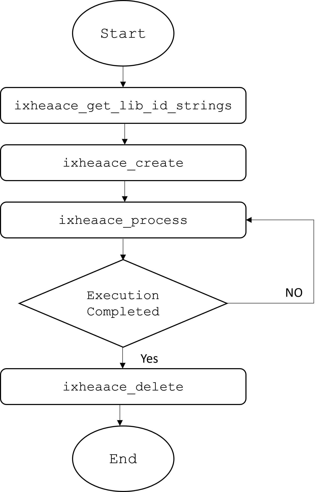

# Introduction libxaac encoder APIs

# Encoder APIs

| **API Call** | **Description** |
|------|------|
|ixheaace_get_lib_id_strings| Gets the encoder library name and version number details |
|ixheaace_create| Sets the encoder configuration parameters, gets the memory requirements and allocates required memory |
|ixheaace_process| Encodes the input frame data |
|ixheaace_delete| Frees the allocated memories for the encoder |

## Flowchart of calling sequence


# Audio Object Types(AOT)
| **AOT** | **Description** |
|------|------|
|2|AAC-LC|
|5|HE-AACv1|
|23|AAC-LD|
|29|HE-AACv2|
|39|AAC-ELD|
|42|USAC|

# Running the libxaac encoder
The libxaac encoder can be run by providing command-line parameters(CLI options) directly or by providing a parameter file as a command line argument.
The reference paramfile is placed in `encoder\test` directory(paramfilesimple.txt)
The configuration file for DRC is placed in `encoder\test` directory(impd_drc_config_params.txt). Please make sure this file is placed in the same directory as the executable.

# Command line usage :
```
<exceutable> -ifile:<input_file> -ofile:<out_file> [options]
(or)
<executable> -paramfile:<paramfile>
[options] can be,
[-br:<bitrate>]
[-mps:<use_mps>]
[-adts:<use_adts_flag>]
[-tns:<use_tns_flag>]
[-nf:<use_noise_filling>]
[-cmpx_pred:<use_complex_prediction>]
[-framesize:<framesize_to_be_used>]
[-aot:<audio_object_type>]
[-esbr:<esbr_flag>]
[-full_bandwidth:<enable_full_bandwidth>]
[-max_out_buffer_per_ch:<bitreservoir_size>]
[-tree_cfg:<tree_config>]
[-usac:<usac_encoding_mode>]
[-ccfl_idx:<corecoder_framelength_index>]
[-pvc_enc:<pvc_enc_flag>]
[-harmonic_sbr:<harmonic_sbr_flag>]
[-esbr_hq:<esbr_hq_flag>]
[-drc:<drc_flag>]
[-inter_tes_enc:<inter_tes_enc_flag>]

where,
  <paramfile> is the parameter file with multiple commands
  <inputfile> is the input 16-bit WAV or PCM file name
  <outputfile> is the output ADTS/ES file name
  <bitrate> is the bit-rate in bits per second. Default value is 48000.
  <use_mps> Valid values are 0 (disable MPS) and 1 (enable MPS). Default is 0.
  <use_adts_flag> Valid values are 0 ( No ADTS header) and 1 ( generate ADTS header). Default is 0.
  <use_tns_flag> Valid values are 0 (disable TNS) and 1 (enable TNS). Default is 1.
  <use_noise_filling> controls usage of noise filling in encoding. Default 0.
  <use_complex_prediction> controls usage of complex prediction in encoding. Default is 0.
  <framesize_to_be_used> is the framesize to be used.
      For AOT 23, 39 (LD core coder profiles) valid values are 480 and 512. Default is 512.
      For AOT 2, 5, 29 (LC core coder profiles) valid values are 960 and 1024. Default is 1024.
      For AOT 42 (USAC profile) valid values are 768 and 1024. Default is 1024.
  <audio_object_type> is the Audio object type.
      2 for AAC-LC
      5 for HE-AACv1(Legacy SBR)
      23 for AAC-LD
      29 for HE-AACv2
      39 for AAC-ELD
      42 for USAC
      Default is 2 for AAC-LC.
  <esbr_flag> Valid values are 0 (disable eSBR) and 1 (enable eSBR). Default is 0 for HE-AACv1 profile (legacy SBR) and 1 for USAC profile.
  <enable_full_bandwidth> Enable use of full bandwidth of input. Valid values are 0(disable full bandwidth) and 1(enable full bandwidth). Default is 0.
  <bitreservoir_size> is the maximum size of bit reservoir to be used. Valid values are from -1 to 6144. -1 will omit use of bit reservoir. Default is 384.
  <tree_config> MPS tree config
      0 for '212'
      1 for '5151'
      2 for '5152'
      3 for '525'
      Default 0 for stereo input and 1 for 6ch input.
  <usac_encoding_mode> USAC encoding mode to be chose
      0 for 'usac_switched'
      1 for 'usac_fd'
      2 for 'usac_td'
      Default 'usac_fd'
  <corecoder_framelength_index> is the core coder framelength index for USAC encoder.
      Valid values are 0, 1, 2, 3, 4. eSBR enabling is implicit
      0 - Core coder framelength of USAC is  768 and eSBR is disabled
      1 - Core coder framelength of USAC is 1024 and eSBR is disabled
      2 - Core coder framelength of USAC is  768 and eSBR ratio 8:3
      3 - Core coder framelength of USAC is 1024 and eSBR ratio 2:1
      4 - Core coder framelength of USAC is 1024 and eSBR ratio 4:1
  <pvc_enc_flag> Valid values are 0 (disable PVC encoding) and 1 (enable PVC encoding). Default is 0.
  <harmonic_sbr_flag> Valid values are 0 (disable harmonic SBR) and 1 (enable harmonic SBR). Default is 0.
  <esbr_hq_flag> Valid values are 0 (disable high quality eSBR) and 1 (enable high quality eSBR). Default is 0.
  <drc_flag> Valid values are 0 (disable DRC encoding) and 1 (enable DRC encoding). Default is 0.
  <inter_tes_enc_flag> Valid values are 0 (disable inter-TES encoding) and 1 (enable inter-TES encoding). Default is 0.
```
Sample CLI:
```
-ifile:input_file.wav -ofile:out_file.aac -br:<bit_rate> –aot:<audio profile>  
```


#  Additional Documents
Brief description about documents present in  `docs` folder
* [`LIBXAAC-Enc-API.pdf`](docs/LIBXAAC-Enc-API.pdf) - Describes Application Program Interface for libxaac encoder.
* [`LIBXAAC-Enc-GSG.pdf`](docs/LIBXAAC-Enc-GSG.pdf) - Getting Started Guide for the libxaac encoder.

# Validating the libxaac encoder
Testing for libxaac encoder is done using listening test for different AOT(Audio object types)
